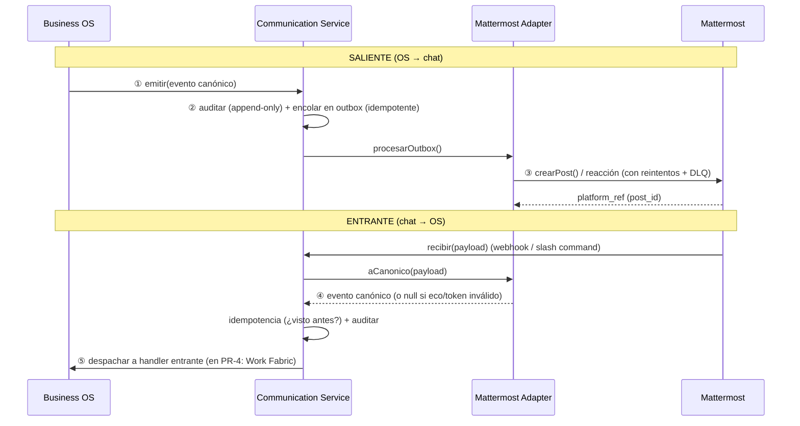

# PR-3 · Communication Layer — Implementación

> **Estado:** esqueleto implementado, probado y demostrado. **No conectado a los especialistas** (eso
> es PR-4). No toca producción, no hace push/merge. Todo vive dentro de `communication-service/`.

Este documento es el entregable técnico del PR-3. Subordinado a la misión del Business OS y a
[`ARCHITECTURE.md`](../ARCHITECTURE.md), que este PR **implementa** sin contradecir.

---

## 1. Qué se construyó (y qué no)

**Sí:** la capa de comunicación definitiva entre el Business OS y Mattermost, **desacoplada por
eventos canónicos**. Mattermost es sólo el medio; el OS sigue siendo el único cerebro; Supabase sigue
siendo la única fuente de verdad. El adapter no tiene lógica de negocio, no guarda estado de negocio,
no es una segunda base de datos.

**No** (a propósito, por el pedido explícito del PR-3): ninguna conexión a Director IA, CFO IA ni
especialistas. El servicio expone el **punto de enganche** (handlers entrantes) donde PR-4 conectará el
Work Fabric — pero PR-3 entrega el circuito de comunicación sólido y probado, con handlers de juguete.

## 2. Arquitectura

```
Business OS  (único cerebro — Director IA / CFO / especialistas / Work Fabric / Supabase)
     │  emite / consume SÓLO eventos canónicos          ▲
     ▼                                                   │
┌── Communication Service (este PR — desacoplado) ───────────────────────────┐
│                                                                            │
│   core/            contrato canónico + motor (emitir/recibir/outbox)       │
│   channels/        un adapter por plataforma (hoy: mattermost)             │
│   events/          persistencia: log de eventos + outbox + DLQ (puerto)    │
│   integrations/    puentes al OS: deep links, identidad, comandos, bot     │
│                                                                            │
└────────────────────────────────────────────────────────────────────────────┘
     │  llamadas concretas a la plataforma               ▲
     ▼                                                   │  webhook / slash command
Mattermost  (sólo medio de comunicación — sin lógica de negocio)
```

Regla dura del desacople: **el OS nunca ve un `channel_id` ni un `post_id`; Mattermost nunca ve un
especialista.** El único idioma que cruza la frontera es el **evento canónico**.

### Diagrama de secuencia — los 5 criterios de éxito



## 3. Estructura de carpetas

```
communication-service/
├── package.json                 # servicio standalone (type: module, npm test / npm run demo)
├── README.md · ARCHITECTURE.md  # diseño (ARCHITECTURE es de PR-1; este PR lo implementa)
├── db/
│   ├── migrations/0001_comunicacion.sql       # schema `comunicacion` (aislado, NO aplicado a prod)
│   └── rollback/0001_comunicacion_down.sql
├── docs/
│   ├── PR-3-IMPLEMENTACION.md   # este documento
│   └── OPERACION.md             # operación + checklists de despliegue y rollback
├── scripts/
│   └── demo-e2e.mjs             # demostración extremo a extremo (0 red, 0 DB)
└── src/
    ├── index.mjs                # superficie pública (única puerta de importación)
    ├── core/
    │   ├── eventos-canonicos.mjs    # EL CONTRATO: sobre versionado, idempotente, auditable, extensible
    │   ├── communication-service.mjs# el motor desacoplado (emitir/recibir/procesarOutbox/handlers)
    │   ├── puerto-adapter.mjs       # interfaz que todo adapter de plataforma debe cumplir
    │   ├── outbox.mjs               # política de reintentos/backoff/DLQ (pura)
    │   └── observabilidad.mjs       # correlation IDs, logs estructurados, spans, métricas
    ├── channels/mattermost/
    │   ├── mattermost-adapter.mjs   # mapeo canónico ⇄ Mattermost (sin lógica de negocio)
    │   └── mattermost-cliente.mjs   # cliente HTTP delgado de la API v4 + FakeMattermost (tests/demo)
    ├── events/
    │   ├── repositorio-memoria.mjs  # puerto de persistencia — impl. en memoria (tests/demo)
    │   └── repositorio-postgres.mjs # misma interfaz sobre el schema `comunicacion` (port inyectado)
    └── integrations/
        ├── deep-links.mjs           # URLs directas a la pantalla del OS (app.ecsas.com.ar)
        ├── identidad.mjs            # puente OS↔plataforma (NO duplica usuarios) — diseño
        ├── slash-commands.mjs       # registro/despachador de comandos (infra; sin funciones complejas)
        └── bot-os.mjs               # identidad/config del bot @os (diseño; sin especialistas)
```

## 4. El contrato canónico de eventos (`core/eventos-canonicos.mjs`)

El sobre es **cerrado y estable**; `data` es **abierto y extensible**. Un evento nuevo es una entrada
en `TIPOS` + (si aplica) enseñarle el mapeo al adapter — el sobre no cambia.

| Campo | Rol |
|---|---|
| `schema_version` | **Versionado.** Sube sólo ante cambio incompatible del sobre; `validarEvento` rechaza versiones futuras. |
| `id` | UUID único del evento. |
| `type` | Uno de `TIPOS` (namespaced `dominio.hecho`). |
| `direccion` | `outbound` / `inbound`, derivada del tipo (la frontera es explícita, no una convención de nombres). |
| `idempotency_key` | **Idempotencia.** Derivada determinísticamente de los campos naturales del hecho (sha256); reprocesar no duplica. |
| `correlation_id` | Hilo causal (se hereda o es la raíz). |
| `causation_id` | Evento que causó éste. |
| `actor` | Quién lo originó `{ tipo, id, display }`. |
| `occurred_at` | Marca temporal ISO. |
| `data` | Carga específica del tipo (extensible). |

**Catálogo de tipos** (`TIPOS`): salientes — `mensaje.publicar`, `mensaje.responder`, `reaccion.agregar`,
`archivo.publicar`; entrantes — `mensaje.recibido`, `comando.invocado`, `reaccion.recibida`,
`archivo.recibido`, `miembro.unido`.

Las 4 propiedades exigidas por el PR-3 están cubiertas y **testeadas**: versionado, idempotencia
(determinística e insensible a campos volátiles), auditabilidad (cadena `correlation`/`causation`),
extensibilidad (sobre cerrado + `data` abierto + `freeze` que impide mutación accidental).

## 5. Interfaces / contratos clave

- **`PuertoAdapter`** (`core/puerto-adapter.mjs`): `plataforma`, `tiposSalientesSoportados`,
  `publicar(evento) → { ok, platform_ref?, error?, reintentable? }`, `aCanonico(payload) → evento|null`.
  `verificarAdapter()` valida la forma en arranque (falla temprana y ruidosa). Agregar WhatsApp mañana
  es implementar este puerto en `channels/whatsapp/`, sin tocar el core ni el OS.
- **Puerto de repositorio** (implementado por `repositorio-memoria` y `repositorio-postgres`):
  `registrarEvento`, `vistoAntes`, `encolarSalida`, `tomarPendientes`, `actualizarSalida`, `aDeadLetter`.
  El servicio depende del puerto, no de Postgres — por eso los tests corren sin base.
- **`CommunicationService`**: `registrarAdapter`, `registrarHandlerEntrante(tipo, fn)`, `emitir(spec)`,
  `procesarOutbox({lote})`, `recibir(payload, {plataforma})`. **Acá engancha PR-4**: registrar un handler
  entrante que publique el evento al Work Fabric y deje que el Director IA decida.

## 6. Garantías

- **Desacople estricto:** el core no importa Mattermost; el adapter no importa el OS; el repo Postgres
  recibe su pool **inyectado** (no importa `orquestador/db.mjs`). Verificado por la ausencia de imports
  cruzados y por los tests que corren el servicio entero con dobles.
- **Idempotencia** en ambas direcciones (clave natural del hecho + unicidad en base).
- **Entrega at-least-once** con **outbox transaccional** + reintentos con backoff exponencial (techo 5
  min, `MAX_INTENTOS=6`) + **Dead Letter** para lo permanente/agotado.
- **Auditabilidad total:** log append-only de todo evento (trigger que prohíbe update/delete, igual que
  `orq.events`), con `correlation_id`/`causation_id` para reconstruir el hilo end-to-end.
- **Observabilidad:** logs estructurados, spans con duración, métricas (contadores/observaciones) — sin
  atar a ningún vendor.
- **Nivel E siempre humano:** el servicio comunica; ninguna acción con efecto económico/legal/fiscal se
  ejecuta desde un canal (lo prepara y queda para aprobación en `pending_operations`, ya en el OS).

## 7. Autenticación e identidad (diseño, `integrations/identidad.mjs`)

Mattermost **no** es una segunda base de usuarios. `ResolutorIdentidad` traduce, contra la tabla
`comunicacion.identidades`, un user de la plataforma ↔ un principal del OS, con nivel de confianza
(`verificado`/`inferido`/`desconocido`). Nunca crea usuarios ni sincroniza contraseñas. Camino futuro
documentado: unificar login vía el mismo IdP del OS (Supabase Auth / OIDC) para que el mapeo deje de
hacer falta — no implementado en PR-3.

## 8. Persistencia (`db/0001_comunicacion.sql`)

Schema `comunicacion` **aislado y aditivo**: `eventos` (append-only, único por `idempotency_key`),
`outbox` (con `claim_outbox` vía `FOR UPDATE SKIP LOCKED`, misma técnica que el Work Fabric),
`dead_letter`, `identidades`, y la RPC `emit()` (evento + outbox en una transacción). **No se aplica a
producción en PR-3**: vive con el servicio y se aplica recién cuando el wiring de PR-4 lo requiera, con
su ventana y su rollback. Mientras tanto, la impl. en memoria cumple el mismo puerto y deja el circuito
100% funcional y testeable.

## 9. Validaciones ejecutadas

| Validación | Resultado |
|---|---|
| `npm test` (node --test, 5 archivos) | **41 pass / 0 fail** |
| `npm run demo` (extremo a extremo) | **6/6 criterios ✅** (los 5 del PR-3 + hilo causal auditable) |
| Cobertura de tests | contrato canónico, outbox/backoff/DLQ, adapter (ambas direcciones + fallos + eco + token), servicio (idempotencia, reintento, DLQ, desacople), deep links |
| Acoplamiento | 0 imports desde `core/` hacia Mattermost; 0 imports hacia `orquestador/`; repo Postgres con port inyectado |

## 10. Análisis de riesgos

| # | Riesgo | Severidad | Mitigación en PR-3 / pendiente |
|---|---|---|---|
| R1 | **Loop de eco** (el bot reacciona a su propio mensaje) | Alta | Mitigado: el adapter ignora `user_id == botUserId`. Testeado. |
| R2 | **Duplicados** por reintentos de la plataforma o del outbox | Alta | Mitigado: idempotency_key determinística + unicidad en base + `vistoAntes`. Testeado. |
| R3 | **Suplantación** de webhooks entrantes | Alta | Mitigado (parcial): verificación de `token` compartido del outgoing hook. **Pendiente**: firma HMAC y allowlist de IP en el reverse proxy. |
| R4 | **Pérdida de mensajes salientes** ante caída de MM | Media | Mitigado: outbox at-least-once + reintentos + DLQ. **Pendiente (PR-4)**: worker que corra `procesarOutbox` en loop + alerta sobre la DLQ. |
| R5 | **Migración aplicada a prod por error** | Media | Mitigado: la migración vive fuera de `echegaray-os/supabase/migrations`; aislada en su schema; con rollback. |
| R6 | **Fuga de contenido** al proxy de push / logs | Media | Los logs no incluyen el cuerpo del mensaje por defecto; el push sigue en `generic` (ver PUSH-MOVIL del PR-2). |
| R7 | **Acoplamiento accidental** en PR-4 (importar internals del OS) | Media | El puerto de repositorio y `registrarHandlerEntrante` son la única superficie; documentado que el wiring inyecta, no importa. |
| R8 | **Token del bot sin configurar** en el wiring real | Baja | `botListo()` falla cerrado y visible (no publica sin credencial). |

## 11. Plan de integración (PR-4 — NO implementar todavía)

1. Registrar un **handler entrante** que, ante `mensaje.recibido` / `comando.invocado`, publique el
   evento canónico al **Work Fabric** (`orq.enqueue_task`) y deje que el **Director IA** enrute al
   especialista. Consultas conversacionales puras pueden ir por `POST /ask` (camino secundario).
2. Wirear el **repositorio Postgres** inyectando el pool del OS y aplicar la migración `0001` en una
   ventana controlada.
3. Correr `procesarOutbox` desde un **worker** (systemd, PR-9) con métricas y alerta sobre la DLQ.
4. Resolver **identidad→rol** real (mapear users de MM a principals del OS) para autorizar comandos.
5. Recién entonces: comandos de dominio (`/os caja`, `/os obra`) apoyados en los **tools existentes**.

Priorización por impacto: (1) y (4) primero — habilitan que el chat sea operativo con el cerebro real;
(2)/(3) dan durabilidad; (5) es la capa de valor visible.
